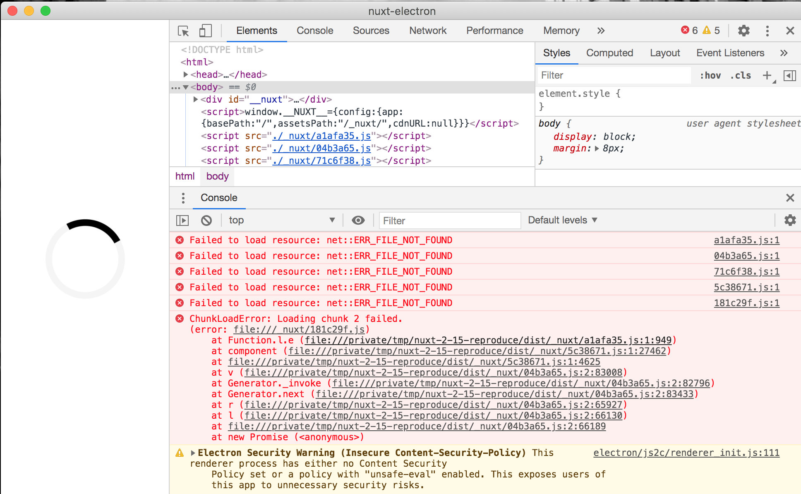

# README
Nuxt 2.15 seems not compatible with 2.14 for [`publicPath`](https://nuxtjs.org/docs/2.x/configuration-glossary/configuration-build#publicpath).

It doesn't work well to load files when we configure `publicPath` as `./_nuxt/`
and [`router.mode`](https://nuxtjs.org/docs/2.x/configuration-glossary/configuration-router#mode) is `hash`.

You can reproduce with this repository.
```
$ yarn && yarn clean && yarn build && yarn start
```

You can see the below error.
```
ChunkLoadError: Loading chunk 2 failed.
(error: file:///_nuxt/181c29f.js)
```


This doesn't happend when we change the version of nuxt to 2.14.0.
```
    "nuxt": "2.14.0",
```
